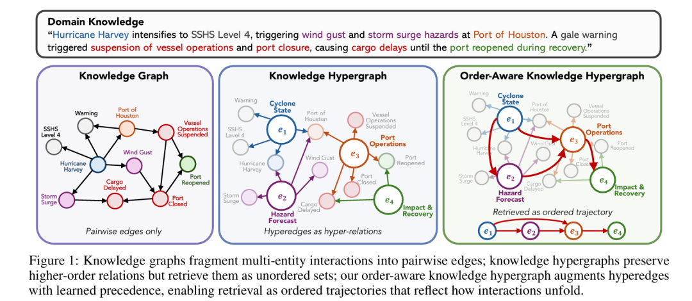
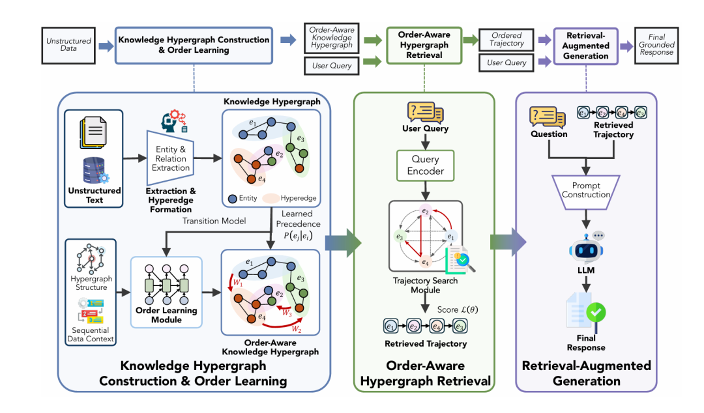
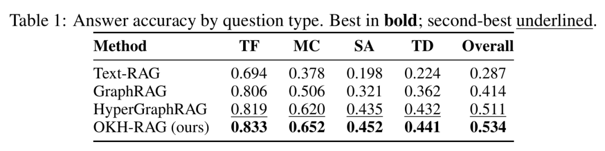
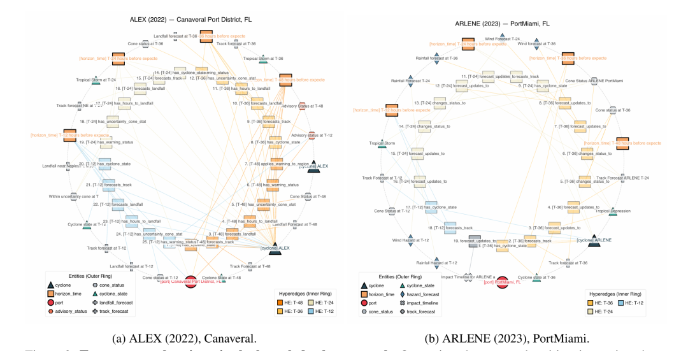
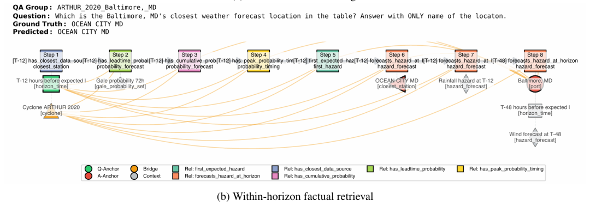

# GraphRAG的断臂，被OKH-RAG攻克了，让AI读懂因果链条

嗨，我是PaperAGI，主要关注LLM、RAG、Agent等AI前沿技术，每天分享业界最新成果和实战案例。

如果你用过 ChatGPT 的联网搜索、或者任何基于 RAG（检索增强生成）的 AI 产品，你有没有想过一个问题：

> AI 在回答你之前，会从数据库里捞出一大堆相关文档。但这些文档的排列顺序，真的重要吗？

过去所有人——包括 Google、OpenAI、以及学术界最顶尖的 GraphRAG 团队——都默认了一个答案：不重要。他们把检索到的证据当作一个"无序集合"，就像把一堆拼图碎片倒在桌上，让 AI 自己拼。

但 Texas A&M 等高校的研究团队在刚刚发布的论文 OKH-RAG中，用严格的数学证明和实验数据告诉我们：这个假设是错的。当证据的顺序会影响推理结果时，任何"排列不变"的检索方法都不够用。

论文甚至给出了一个形式化命题（Proposition 1）：存在查询 q 和证据 a、b，使得 P(y|a,b,q) ≠ P(y|b,a,q)。换句话说，同样的两张牌，先出 A 再出 B，和先出 B 再出 A，AI 得出的结论可能完全不同。

## 问题进一步拆解

为了让你直观感受这个盲区有多致命，论文举了一个极具现实意义的场景：热带气旋（飓风）对美国港口的冲击评估。

想象你要回答这样一个问题：

> "如果飓风 Arthur 保持当前速度和方向，预计会在哪里登陆？"

要准确回答，AI 需要整合以下信息：

这些信息不是孤立的。T-24 的预测依赖于 T-36 的状态，T-12 的确认又依赖于 T-24 的更新。如果你把 T-12 的证据放在最前面，T-36 放在最后面，AI 可能会把"最终结果"当成"初始状态"，完全搞反因果链条。

但传统的 Text-RAG、GraphRAG、甚至最先进的 HyperGraphRAG，都是把检索到的证据打乱了喂给 AI。它们只关心"找没找到相关片段"，不关心"这些片段应该以什么顺序呈现"。

## OKH-RAG 的解法

OKH-RAG 的核心创新可以用一句话概括：不再检索"相关事实的集合"，而是检索"有序交互的轨迹" 。

### 从知识图谱到超图

传统知识图谱（Knowledge Graph）只能表示两两之间的关系（二元关系），比如"飓风 Harvey → 引发 → 风暴潮"。但现实世界的因果往往是多对多的：

> "飓风 Harvey 增强到 4 级 + 休斯顿港的地理位置 + 当时的风切变环境 + 港口防御状态 → 共同导致 → 港口关闭、货物延误"

这种"多个因素共同导致一个结果"的关系，用传统图谱必须拆成很多条二元边，信息会碎片化。OKH-RAG 使用超图（Hypergraph），一条"超边"（Hyperedge）可以直接连接任意数量的实体，完整保留多因素交互的语义。

### 从静态到动态

但超图 RAG 之前的方法仍然把超边当作"静态事实"——它们知道"哪些因素有关系"，但不知道"这些因素是按什么顺序展开的"。

OKH-RAG 引入了顺序感知超图。它在超图的基础上，增加了一个"优先级结构"（precedence structure），把知识表示为一个有序的状态序列 H(l)，而不是一个无序的集合。

具体来说，每个超边不再只是 e = (实体集合, 关系, 描述)，而是被赋予了一个序列索引 l，表示它在整个推理链条中的相对位置。比如：

这样，检索就不再是"找 4 个相关超边"，而是"找一条从 e₁→e₂→e₃→e₄ 的连贯轨迹"。

### 学习顺序

最巧妙的是：现实世界的文档很少明确标注"这条信息应该在第几步出现"。OKH-RAG 设计了一个自监督的顺序学习模块，通过三种信号自动推断优先级：

通过一个非对称的双线性转移模型 P_θ(e_j | e_i)，系统学会"从 e_i 出发，下一步最可能走到哪个 e_j"。这个模型天然具有方向性——P(e_j|e_i) ≠ P(e_i|e_j)，完美编码了先后顺序。

## 检索不再是挑碎片，而是拼轨迹

传统检索的目标是：给定查询 q，返回 top-k 个最相关的文档片段。每个片段独立打分，互不影响。

OKH-RAG 把检索重新定义为序列推断（Trajectory Inference）：给定查询 q，找到一条最高分的有序轨迹 γ = (e⁽¹⁾, e⁽²⁾, ..., e⁽ᴸ⁾)。

这条轨迹的打分由五个维度共同决定：

论文还使用了束搜索（Beam Search）来高效寻找最优轨迹，并支持多轨迹检索——当一个问题存在多条合理解释路径时，系统会返回多条候选轨迹，让生成模型交叉验证。

## 实验分析

论文在 CyPortQA 数据集上做了严格测试。这个数据集包含 2015-2023 年间 90 场真实飓风和 145 个美国港口的 11.7 万道问题，涵盖判断题、选择题、简答题和描述题，且大量问题需要跨时间窗口（T-120 到 T-12）整合证据。

### 基线对比

最关键的发现：OKH-RAG 和 HyperGraphRAG 使用完全相同的底层超图，唯一的区别是前者把超边组织成有序轨迹，后者当作无序集合。这种控制变量的设计，严格证明了性能提升单独来自顺序建模，而非其他因素。

### 适应场景

论文通过可视化两个真实飓风（ALEX vs. ARLENE）的超图结构，发现了一个有趣规律：

这告诉我们：OKH-RAG 不是"在所有场景都有用"，而是在真正复杂的动态推理场景中，它是从"能用"到"好用"的关键一跃。

### 自适应检索

论文还展示了 OKH-RAG 的查询自适应能力：

这说明系统不是盲目地"加顺序"，而是根据问题的推理需求，动态决定轨迹的广度与深度。

## 个人总结

OKH-RAG 的标题叫 "Knowledge Is Not Static" （知识不是静态的）。这句话的深层含义是：我们过去所有的知识检索系统，都在把知识当作一张照片，而现实世界需要的是一段视频。

OKH-RAG 迈出了关键一步：它让检索系统从"找碎片"升级为"拼轨迹"，让 AI 终于有机会"看懂"因果，而不只是"记住"事实。

