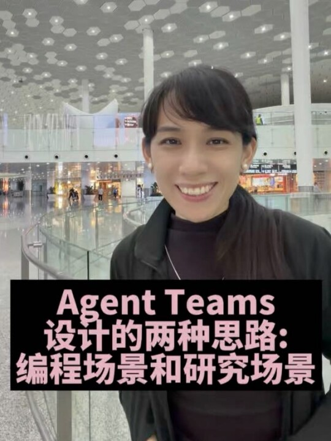

# 晓辉博士：在飞机上琢磨了研究场景的Agent Teams有哪些必要角色

## 基本信息

- 作者：晓辉博士
- 发布时间：2026-03-27T23:24:42+08:00
- 原始链接：https://weixin.qq.com/sph/AFH1y1aqSF
- 预览链接：https://channels.weixin.qq.com/finder-preview/pages/sph?id=AFH1y1aqSF
- 收藏：1167
- 转发：1632
- 点赞：469
- 评论：92

## 视频文案

在飞机上琢磨了研究场景的Agent Teams有哪些必要角色，下了飞机迅速查了下Anthropic的设计哲学，发现他们讲的是面向编程场景的Agent Teams的编排，跟我讲的研究场景还是有很大区别的，尽快分享一下，跟有需要做研究的朋友们分享下。#AgentTeams #Agent #智能体编排 #Anthropic #AI

## 字幕状态

已使用 OpenRouter `openai/gpt-4o-mini-transcribe` 对用户提供的本地媒体文件执行 ASR，结构化结果写入 `transcript.json`，逐字稿正文已合并到本文件。
ASR 切片数：6；费用：约 $0.01127875。

## 逐字稿

> ASR: OpenRouter `openai/gpt-4o-mini-transcribe`；语言：`zh`；时间戳为按音频切片生成的近似边界。

[00:00:00 - 00:01:00] 哈喽,下飞机了,我最近不是入坑了Agent Teams吗,就是智能体小队的这个编排,然后对这个东西非常感兴趣,然后在飞机上呢,我一路反思,也想到就是作为这种研究场景的这种Agent Teams该如何设计,所以非常想跟大家分享一下,因为我们知道Anthropic它其实在Agent Teams的设计上是非常有一套的,而且在去年年底今年年初都发表了很多相关的文章博客,但是我发现他们有一个问题,就是他们其实是面向一些确定性的编程场景的multi-agent协作,那它里面有几个特征哈,比如说像它需要一个明确的架构,就是要有一个PM负责组织整个的Agent来去做研发,那下面有一些执行的Agent,然后需要设立一些特别明确的验证机制,就是到底什么方向你做对了,对,我是该怎么去激励你,对,这个是非常明确的,还有就是我需要这些执行的Agent之间,它不需要有太多的讨论,它执行就好了,所以在这

[00:01:00 - 00:02:00] 这个场景下他们会倾向于用一个非常聪明的模型,比如说Open4.6,它作为大脑,就是做规划,做决策,做指导,那底下呢用Haiku,就是它比较快的去执行的这样的一些agent做执行,所以在他们写C编译器的这个实践中,他们就用这样的一套方式来去进行协作,所以这个也是大部分的软件开发工程中用multi-agent的一种方式。当然可能有不同的环节哈,比如说开发测试,对吧,然后包括这里面也会有一些对抗去挑战已有的一些成果。但是我觉得研究场景是非常不一样的,因为我上次分享那也是我第一次觉得非常的惊艳哈,用multi-agent做研究。后来我这两天也先后做了好几个这种multi-agent的研究,我也总结出来了一些规律,因为像这种研究场景,不确定性的这种场景和这种做执行的写代码的场景还是非常不一样的。所以我也发现了几点有助于大家去提高multi-agent在研究场景应用的一些方式。那这两点

[00:02:00 - 00:03:00] 这种类型的毛题agent它有一些地方是一致的,比如说它需要通过文件交互,让agent把它的发现要写到文件里面,下一个agent是可以读取的。那比如说像它需要层级,必须有一个PM去控制整个研究的进度,那也需要有审核机制,对吧,你的标准是什么?这些都是一致的,那不一致的是什么呢?就是我觉得在研究型的这个agent team中,它需要有一个非常强有力的批判者,就是我们做研究,你需要有批判性思维,需要站在第一性原理的角度去持续的反思已有的这些假设是不是对的,所以就在执行者,就是这些负责不同方向的,比如有的负责硬件,负责软件,负责应用研究,它每个prompt是不一样的,它的这个专家在做完研究之后,要有一个批判者去批判他们的研究,去质疑他们是不是应该做这件事,或者是他们做的方法对不对?那这是一个非常不一样的点,因为我发现我的那个研究结果有批判者,它的效果是非常好的,因为我让AI去反思到底那

[00:03:00 - 00:04:00] 这些agent的设计是必要的,他觉得这个批判的批判角色是非常非常必要的,因为它会给你完全不一样的视角,因为一般的agent会倾向于自圆其说,但是有了批判的视角就有一种对抗,对,我觉得这个是一个非常关键的点。再有一个呢,就是你要在这个把agent team里面设定一个探索者,就是这个探索者呢,他不是在已有的圈圈里打转,比如说我已经看到了这么多文献,那是不是这些文献就可以给我足够的信心?不一定的,因为研究是个开放性的事情,所以他要去再去找其他的新的视角,然后找过来以后再去补充到现有的研究中,所以要有这么一个探索者,其实这也是为什么在一些团队中会预留20%的探索时间,让你去尝试很多新的机会,这个是做创新必要的一个条件,所以在这个过程中引入探索者也是非常必要的。然后第三个呢,就是在编程场景,其实它不需要multi-agent之间很多的通讯,它可能就是告诉下一个agent我做完了,你看一看,他们其实是避免讨论的,因为如果过多

[00:04:00 - 00:05:00] 讨论会导致非常乱,引入了很多噪声,因为它是确定性的场景,我不需要你讨论,你执行就完了。它特别像是工业时代的那种agent,但是来到了一个AI时代,或者说一个不确定的时代,你面对一个不确定性的问题,这些agent之间是需要讨论的,因为他们之间是有学科的gap,或者说他们之间是通过讨论能够不断启发出一些新的思考。所以他们之间的通信就变得非常非常的重要。所以这也是我认为目前的agent在研究场景,在一些不确定性场景的设计中需要考虑的几个要素,比如说一个PM,聪明的大脑,那一些执行的,就是不同方向的执行专家,就是他擅长不同领域,他的prompt是不一样的。第三个就是批判者,去挑战他们的,不断去挑战。第四个就是探索者,去在前沿上可以有更多的展开和延伸的探索。然后第五,最后一个可能就是做一些总结类的工作。那所以就是这几个要素是非常非常重要的。

[00:05:00 - 00:06:00] 最重要的可能还是你这个方向要去哪儿,你为什么要做这个研究,然后你做的这个研究有什么价值,这些是要人来去补充的。所以这个是今天跟大家的一个分享,就是关于我对这个multi-agent的一个理解。我看看接下来能不能把这个东西做成一个skill,下一周我一定去上传到github,把我之前说的记忆系统,multi-agent协作,对,等等吧,一些我能想到的,对大家有帮助的,我去上传到我的github上。祝大家周末愉快,拜拜。

## 本地资源

- cover: `assets/cover.jpg`
- avatar: `assets/avatar.jpg`
- auth_icon: `assets/auth_icon.png`

