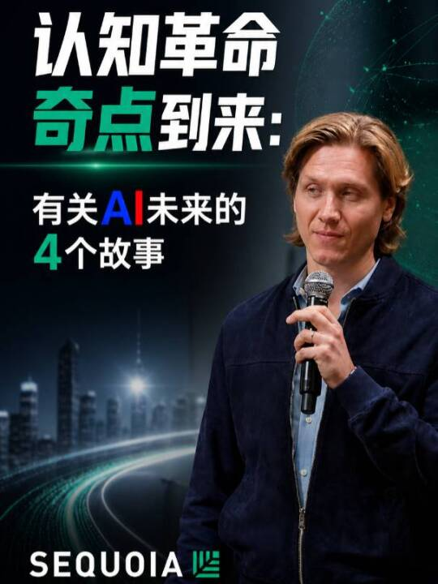

# 小Fai哥看世界：红杉资本：认知革命奇点到来——有关AI未来的4个故事

## 基本信息

- 作者：小Fai哥看世界
- 发布时间：2026-05-05T08:30:00+08:00
- 原始链接：https://weixin.qq.com/sph/AzRPLyKxfv
- 预览链接：https://channels.weixin.qq.com/finder-preview/pages/sph?id=AzRPLyKxfv
- 收藏：3005
- 转发：1.0万
- 点赞：2204
- 评论：104

## 视频文案

红杉资本：认知革命奇点到来——有关AI未来的4个故事
#红杉资本 #认知革命 #人工智能 #科技趋势 #外星设计 #智力贬值 #未来科学 #人是万物的尺度 #AI原生

## 字幕状态

已使用 OpenRouter `openai/gpt-4o-mini-transcribe` 对用户提供的本地媒体文件执行 ASR，结构化结果写入 `transcript.json`，逐字稿正文已合并到本文件。
ASR 切片数：9；费用：约 $0.01532000。

## 逐字稿

> ASR: OpenRouter `openai/gpt-4o-mini-transcribe`；语言：`zh`；时间戳为按音频切片生成的近似边界。

[00:00:00 - 00:01:00] In this section, we're going to talk a little bit about what's next. So the goal here is, we all know we're in the AI age. What's it going to look like? What's it going to feel like? How is it characterized? Earlier in the presentation, Pat bifurcated technological revolutions between compute and communication. We're going to do another bifurcation here for types of work. There is physical work. This is a package on the Pony Express. This is a satellite on a Falcon 9. Work equals force times distance, physical movement. And then there's cognitive work. This is Pythagoras coming up with his theorem. This is DeepMind solving the protein folding problem, conscious thinking. These are very different types of work, but we believe that they're going to follow a very similar pattern in revolution. So let's talk about physical work, because we've been through this revolution with the industrial revolution. For the vast majority of human history, all the work, or virtually all the work, for serving humans was done by some sort of muscle. People or animals. People moving something, or an animal pulling the human.

[00:01:00 - 00:02:00] This starts at 1700, but it goes back millennia. Then things started to change. Water and wind, steam engines. And then things accelerated. Steam engines, combustion, electric motors. Today, 2026, you could estimate that 99 plus percent of all the physical work done on planet Earth for humans is done by a machine. The plane that brought you here, the manufacturing of all the goods in this room, all the transportation that sets out for the pinnacle of the human experience you're having right now. Well, we think a similar pattern is going to happen in cognition. We're just a little earlier on. So for most of human history, all the thinking on planet Earth for humans was done primarily by humans, maybe a little bit for animals, the sheepdog chasing the sheep, right? And there was this sliver on top of mechanical work, the astrolabe or the clock. Now, over the past couple hundred years, there was not a lot of progress until...

[00:02:00 - 00:03:00] electronic computation. And in the past hundred years, think about all the trillions of calculations that are happening at any given moment to serve you, the human. All of that work, all of that cognitive work that's happening to serve us at any given moment. Trillions of calculations. We believe that the neural network is the next big wave, and that in the near future, 99.9% of cognition on planet Earth will be done by machines. Well, the parallel is pretty stark. And the good news is we've been through a revolution like this. The cognitive revolution is going to be a lot like the industrial revolution, just much, much bigger and much faster. So what's it going to be like living in this future? I'd like to share some motivations for this future in the form of four short stories. The first story. In the mid-1800s, America wanted to build a grand monument to our first president and our greatest war hero, George Washington.

[00:03:00 - 00:04:00] So we designed the tallest building in the world at the time, the Washington National Monument, and we wanted to cap it with the most precious metal in the world, 100 ounces of the most precious metal in the world. So precious, in fact, that we put it on display at Tiffany's in Manhattan. That metal was aluminum. Within decades of the completion of the Washington National Monument, a young inventor came up with electrolysis, the process of separating aluminum from dirt. And within decades, aluminum was used to wrap our candies and our sandwiches and then tossed into the trash. Aluminum is intelligence. Electrolysis is artificial intelligence. We're about to enter a world where some of the most precious skills that took decades to earn, PhD-level skills, are so instantly invoked that right after using them, you can crumple them up and throw them right in the trash.

[00:04:00 - 00:05:00] Story number two. We are entering a world of alien design. The world as we see it today is all about design for humans. You know, it's been optimized in a way that makes sense to our brains because we are doing almost all the cognition in the world. Well, when machines do the cognition, it's going to be a little different. In 2006, NASA was optimizing an antenna for a large space mission, satellite space mission. And traditionally, their antennas looked like this. It was a beautiful geometric symmetrical pattern that optimized surface area for some power constraints. This time around, they said, we're going to hand it over to a computer, and we're going to have an evolutionary algorithm, a lot like reinforcement learning. The result? This antenna right here. Dramatically more productive, not intuitive to the human mind. In this AI era, when we hand over cognition to machines, we're going to get results that are not intuitive to us. When AI is designing chips, cars, buildings, they might look dramatically different. The world that we enter into, we have to be open-minded because the AI is not going to think like us.

[00:05:00 - 00:06:00] It's going to have alien design. The third motivation story is on emerging sciences, not emerging science. We all know there's emerging science. I'm talking about emerging sciences. In the early Industrial Revolution, you had great engineers like Newcomen and Watt, and they perfected combustion engines. Basically, put a petrochemical into a piston, ignite it on fire, millions, billions of particles explode, move the piston, work. For almost a hundred years, all of that was tinkering. It was an engineer saying, ah, that works a little bit better. Maybe something you could see like a scaling law, but it was engineers playing with the product and seeing how they could improve it a little bit. Over a hundred and twenty years after, Sadi Carnot came around and formalized this in a new science, thermodynamics. He said, wait a second, there are millions or billions of particles. We can actually formalize what that all looks like. In this case, there are billions of neurons, trillions of tokens. Right now, we're in the tinkering phase of AI. Even if we think it's an understood science, it's not.

[00:06:00 - 00:07:00] In the future, we will have a science as fundamental as thermodynamics introduced in the next couple decades. Someone in this room might come up with that science. And that science will be taught in high schools. It will be that fundamental. And it will help us master AI. It will even help us master consciousness. Fourth story, the art of unreason. So for the vast majority of human history, tens of thousands of years, art has been a progression towards realism. This is a cave painting from about 25,000 years ago, Egyptian hieroglyphs, Greek pottery, Renaissance paintings, a grand transformation toward realistic art. Just look at the difference over tens of thousands of years, the triumph of humanity. And then engineering came along, the daguerreotype, early photography. And all of a sudden, what we spent decades of life to perfect the skill of getting every brushstroke perfect, gone.

[00:07:00 - 00:08:00] So how did the world react? They thought that painting was over. Well, that's it. The machine can do it better than any human. Art has ended. Well, what happened? How did humans respond? Humans responded by saying, was the purpose of this art to capture the moment in the way the eye sees it, or was it to capture the moment in the way the heart and the soul sees it? Impressionism, expressionism, cubism, neo-expressionism, all these new forms of art are how humanity responded to this dramatic change in science. 2,500 years ago, Greek philosopher Protagoras wrote, man is the measure of all things. What he meant is that nothing in a vacuum has value to humans. Not aluminum, not art, not intelligence. It only has value because of the experience.

[00:08:00 - 00:09:00] AI can do the work. AI will do the work. But only the human connection can give you a reason to care. That's why we're all in this room today. A decade from now, work is going to be dramatically different. Things are going to change so much, but the one thing that will be constant is the relationship that you form today with the person right next to you will endure. That's what you're going to look back on. That's what's going to be valuable from today. So I encourage you to form those relationships with the people next to you, enjoy your time together at this AI event, and really lean into what makes us most human.

## 本地资源

- cover: `assets/cover.jpg`
- avatar: `assets/avatar.jpg`
- auth_icon: `assets/auth_icon.png`

